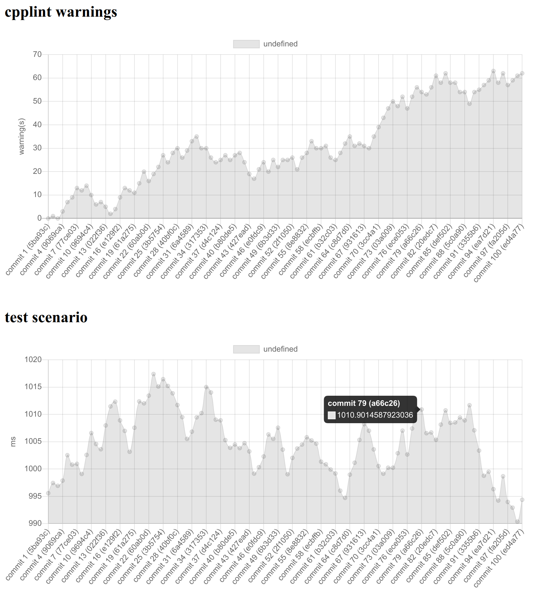

# Cocoball

Cocoball is a continuous benchmark dashboard. You can use any language and benchmark tool (C++ and Catch2, Pytest and time, ...), as long as you export the benchmark result to a json or toml.
The benchmark number does not need to be about the speed. You can plot the number of lint warnings or build time.



## Status
working but ugly.

## Usage
```
cocoball serve
```
This will listen to http://localhost:8080/ by default. It reads from `data/` and renders to `out/`.

## Todo before 1.0
- host/port cli flag
- benchmark grouping (e.g. two lines in one plot)
- 'unit' and 'opt' in a separate file
- better design for plot tooltip
- re-generate on filesystem change
- detects and shows the regression
- a simple fitting for advanced regression detection (step-fit from Android)
